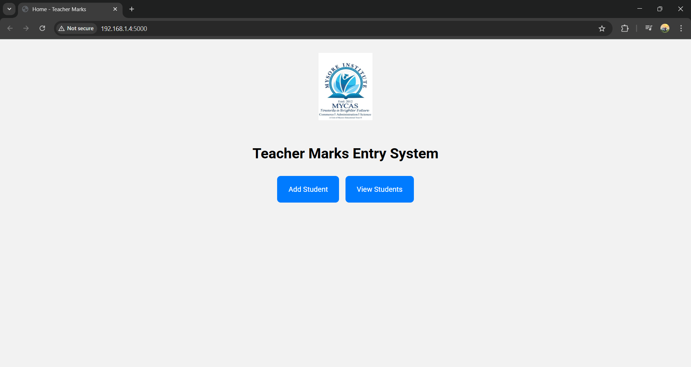
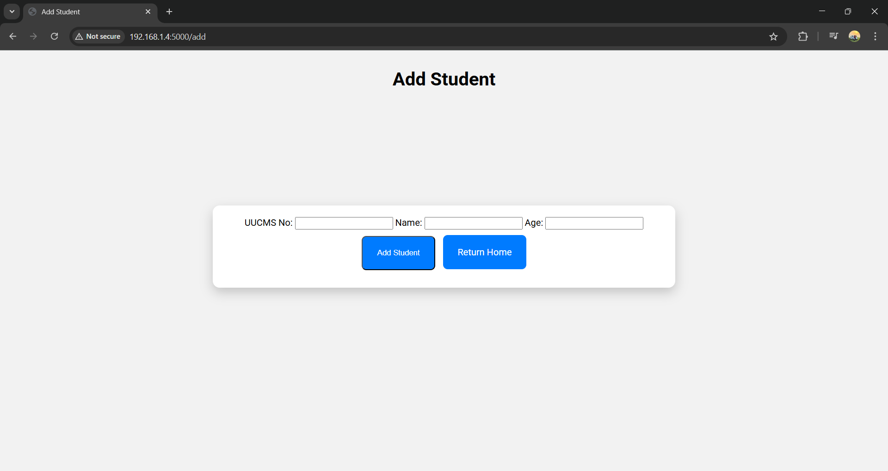
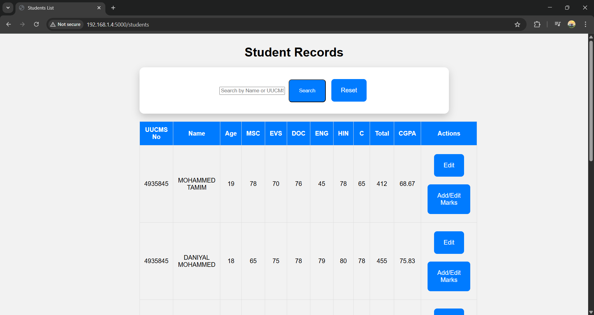
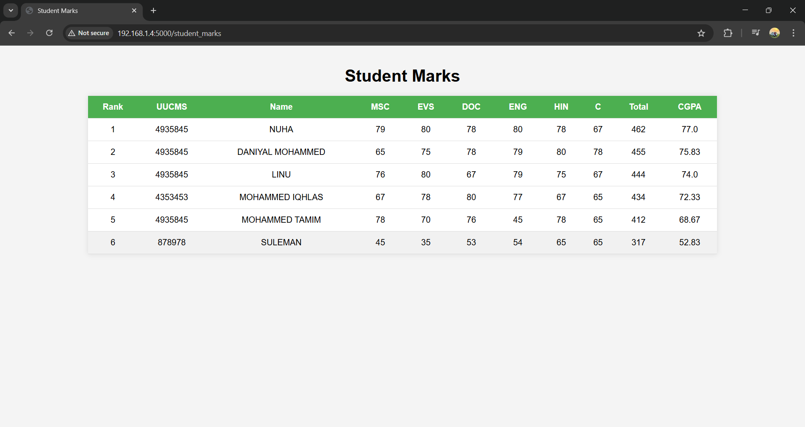

# Student Marks Management App

[](https://www.python.org/)
[](https://flask.palletsprojects.com/)
[](https://www.sqlite.org/)

## Overview
The **Student Marks Management App** is a simple and intuitive web application for managing student records and marks.  
It allows users to **view all students, their marks, and CGPA**, sorted from highest to lowest.  
This project was developed with guidance and assistance from AI tools to structure and optimize the code, showcasing a professional approach to web app development.

## Features
- Add, edit, and view student information (admin-only)
- Add and edit marks for students (admin-only)
- View all students with CGPA sorted descending
- Search students by name or ID
- Mobile-friendly student marks view (read-only)
- Secure admin-only routes to prevent unauthorized access

## Screenshots
> Screenshots are examples; your data may vary.







## Technologies Used
- Python 3.9+
- Flask
- SQLite3
- HTML/CSS (for templates)

## Getting Started
### Clone the Repository
To get a local copy of the project, run:

```bash
git clone https://github.com/MOHAMMEDDANIYALM/PythonCodeCollection.git
cd PythonCodeCollection/projects/marks_app

## Install Flask if you don’t have it 
pip install flask

##Run the App
Run the App 

##Open in Browser
PC: http://127.0.0.1:5000/ → full access

Mobile (same network): http://<PC-IP>:5000/student_marks → read-only student table